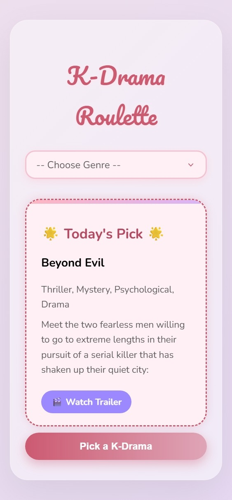

# 🎬 K-Drama Roulette

A cute and aesthetic web app that helps you pick a K-Drama to watch — either randomly or based on your mood!
Try it out: https://shamaiem10.github.io/Kdrama-Roulette-App/

## 💡 Features

- 🎡 Random K-Drama picker
- 🎭 Genre-based filtering
- 😊 Mood-based recommendations
- 🎀 Soft, glassmorphism-style UI
- 🎬 Trailer preview links

## 🚀 How to Use

1. Clone or download the project.
2. Open `index.html` in your browser.
3. Select a genre or take the mood quiz.
4. Click the button to get your perfect K-Drama match!

## 🛠️ Tech Stack

- HTML
- CSS 
- JavaScript
- Local JSON file (`kdramas.json`)

## 📸 Preview

## 📁 Files

- `index.html` – Main HTML
- `styles.css` – All styling
- `script.js` – App logic
- `kdramas.json` – K-Drama data

---

Made with 💜 for K-Drama lovers!
